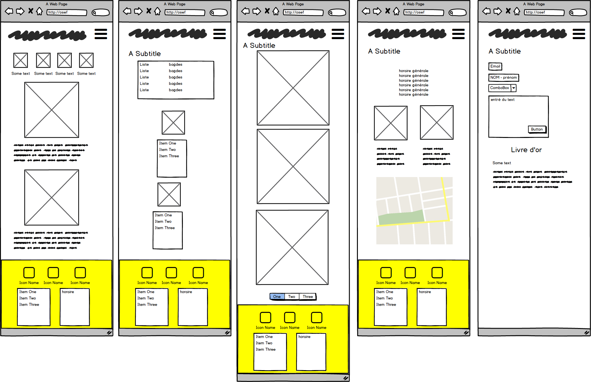

## Who did the project?
- Mourmeaux Jean
- Sekri Yassine
- Caturano Luciano

## What is that ?

Creation of a showcase site for a restaurant franchise. The franchise is fictitious but the type of food (burger, pizza, Asian, ...) is left to the learner's choice.

The site must be responsive: at least for small screens (xs) and medium screens (md)

Minimum 5 pages accessible by a navigation bar (navbar) present on all pages and leading to the different sections: Home, Map, Photos, Restaurants, Contact.

W3C clean !

## When did you work on it?

Duration : 3 days

Deadline: January 9, 2020, 5:00 p.m.

## languages ​​used?

- HTML
- SCSS
- Bootstrap
- Javascript (no encoding, just copy and paste)

## Composition of the site

|         Intitulé           |       Page        |   Jumbotron  |   Badges    | Font Awesome | Pagination  | 
| :------------------------  | :---------------: | :-----------:| :--------:  | :----------: | ----------: |
| Accueil                    |        ✔️          |       ✔️      |             |       ✔️      |             |       
| Carte                      |        ✔️          |              |      ✔️      |       ✔️      |             |        
| Photos                     |        ✔️          |              |             |       ✔️      |  ✔️      |      
| Restaurants                |        ✔️          |              |             |       ✔️      |             |        
| Contact                    |        ✔️          |              |             |       ✔️      |             |           

## Mockup

## Place of realization

